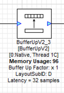

lib_awe: AWE Core for xcore
===========================

Introduction
------------

Audio Weaver comprises GUI tools (Designer) and libraries (Core) for implementing audio Digital
Signal Processing (DSP) algorithms. Developed by DSP Concepts (DSPC), it delivers signal processing
building blocks, referred to as "modules". Module capabilties range from simple filtering to data
type conversions all the way to much more specialised processing. These can be assembled, deleted
and rearranged in the Designer GUI and then executed on a device. A control library is available
that enables on-line control of the blocks.

xcore is a programmable multi-core device with flexible DSP and IO interfaces. The IO interfaces can be programmed to, for example, I2S, TDM, USB, ADAT or S/PDIF interfaces (or indeed any other interface), and the DSP capability can be used to operate on data that is received from or sent to these interfaces. In addition to interfaces and DSP, xcore devices can also execute control code or even ML inference engines.

``Lib_awe`` is a port of Audio Weaver Core for XMOS's powerful xcore.ai device. It contains code for software threads which wrap the core library and provide easy interfacing to both audio streaming components such as I2S and USB Audio as well as tuning interfacing to allow control and loading of pre-built designs from a host or internally from the device.

It utilises xcore.ai's multi-threaded architecture and vector processing unit to provide very high performance and predictable timing required by embedded systems.

.. note::
    This document refers to the XMOS specific implementation details. DSP Concepts provide several documents on the usage and integration of Audio Weaver into the user's system. Please refer to https://documentation.dspconcepts.com for documentation specific to Audio Weaver.

For reference, we refer to the following repositories that you may want to
use:

* <https://github.com/xmos/lib_awe.git> for the library that integrates
  Audio Weaver and xcore.

* <https://github.com/xmos/lib_xua.git> for the USB Audio library
  design

.. note::
    The ``lib_awe.a`` file is not provided as part of the lib_awe repository for commercial reasons.
    Please obtain this file from your XMOS or DSPC contact directly.

Architecture
------------

``Lib_awe`` provides an interface to the audio streaming and tuning functions using xcore channels which allow placement of the application blocks on different tiles from lib_awe.

.. figure:: ../images/lib_awe.drawio.png
   :width: 100%

   lib_awe thread diagram


``lib_awe`` consists of a group of threads. There are a statically defined number (maximum 5) of DSP worker threads which perform the AWE core functionality within the Audio Weaver runtime core.

To support audio streaming an audio transport thread provides a channel interface to the Audio Weaver ``awe_audioImportSamples()`` and ``awe_audioExportSamples()`` functions. The purpose of this thread is to simplify connection to XMOS audio streaming components and user application logic and allows placement of the user application logic on a different tile.

Finally, a tuning thread is provided which abstracts away the ``awe_packetProcess()``` function calls and provides a channel API and also presents a channel interface allowing placement of control to be on a different tile. In AWE nomenclature, this provides a ``tuning interface`` which is different from a ``control interface`` in that the control interface uses function calls whereas tuning is a remote operation. The same functionality is available for both AWE control approaches however, for the xcore port, the ``tuning interface`` method is default since it allows control logic to be placed on a remote tile that does not share memory space with the AWE tile.

The channel-based tuning interface supports multiple clients. The USB/HID and internal ``xawe_*****`` commands (see API) implement a mutex which allows multiple instances of tuning to be used at the same time so long as they are all on the same tile. The majority of the tuning commands consist of a command and a response however it should be noted that, when loading an AWB file (which is essentially a block of commands) from AWE Designer, interrupting the load with other commands may result in undefined behavior. The internal ``awe_loadAWB***`` commands that can be used from the firmware do implement locking around the whole image load operation and so cannot be interrupted by an external tuning command.

All of the described threads for lib_awe need to be placed on the same tile. Since the majority of one tile's RAM and many of the threads are typically used by lib_awe it is typical to dedicate one tile to lib_awe and use the other tile for application logic. However, low-memory usage tasks such as I2S may also be placed on the lib_awe tile (when required by hardware IO constraints) and this is demonstrated in the USB Audio Example.

An additional thread may be used in the case where the AWE Flash File System (FFS) is enabled. The FFS can be used to store compiled AWE design files. The flash server thread provides a remote flash memory access server meaning that the AWE Core and the flash memory IO may exist on different tiles. Use of the FFS is optional and can be enabled or disabled using defines (see API). The flash server makes use of the flash access API provided in the XMOS tools ``quadflashlib.h``. Documentation regarding this can be found in the `XTC Tools Manual <https://www.xmos.com/documentation/XM-014363-PC-9/html/tools-guide/tools-ref/libraries/libflash-api/libflash-api.html>`_.

.. _sec_lib_awe_api:

lib_awe API
-----------

In order to use the functions, one needs to configure the library to use the correct number of audio channels, threads, and heaps. To this effect, create a file ``awe_conf.h`` in your project that defines the values in :numref:`tab_defines`. Note, the ``xcommon-cmake`` build system will automatically find and use this header file.

.. _tab_defines:

.. table:: User defines

    =============================== ============
    Define                          Values
    =============================== ============
    AWE_DSP_THREAD_NUM              1..5
    AWE_INPUT_CHANNELS              0 or more
    AWE_OUTPUT_CHANNELS             0 or more
    AWE_BLOCK_SIZE                  32 (nominal)
    AWE_HEAP_SIZE_LONG_WORDS        1024 or more
    =============================== ============

The ``AWE_BLOCK_SIZE`` value may be adjusted and designs can be created according to this setting however a block size of 32 is recommended as a good trade-off between system latency, memory usage and CPU efficiency which is higher for larger block sizes.

``AWE_HEAP_SIZE_LONG_WORDS`` is dependent on your particular design requirements. Even in maximal configurations, AWE on xcore allows for at least 50 k long words of heap size.

Some values are, at present, pre-set:

.. table:: Pre-set defines

    =============================== ===========
    Define                          Values
    =============================== ===========
    Sample rate                     48,000 Hz
    =============================== ===========


A single function is provided to wrap the entire ``lib_awe`` implementation and automatically spawns all of the worker and helper threads. If the FFS is used then this thread must be started by the user, as shown in the application example. In addition, where USB/HID is used as the control interface, an API is provided which takes care of translating messages to and from the HID endpoint and to and from the lib_awe tuning thread.

``lib_awe`` also provides a number of remote tuning function APIs which allow loading of AWB designs, profiling and the setting and getting of tuning parameters from firmware. The external USB/HID interface may co-exist with internal tuning functions. Other interfaces may be used such as UART or I2C although these are not currently implemented.

API Listing
~~~~~~~~~~~

.. doxygengroup:: lib_awe
    :content-only:

Integrating lib_awe into your Design
------------------------------------

There are two main APIs for ``lib_awe``; audio data path and control.

Data (Audio interface)
~~~~~~~~~~~~~~~~~~~~~~

The data xcore-channel handles the passing of audio samples to and from lib_awe. It consists of a single channel which allows a bi-direction exchange of samples. A convenience function is which is called from the user thread handling audio samples is provided by the API::

    void awe_offload_data_to_dsp_engine(chanend_t c_to_awe, unsigned toAWE[], unsigned fromAWE[])

This function passes a frame of samples over the channel to ``lib_awe`` and receives processed samples back from ``lib_awe``. It is `sample based` meaning that it should be called at the native sample rate of the system which is nominally 48 kHz. The frame size is the number of audio channels supported by the system. Processing of a block of samples (typically 32 for AWE) is handled by a user design loaded into ``lib_awe`` which is why a ``buffer up`` block is the first and last part of a pipeline. For a block size of 32, the minimum latency for pushing samples into AWE and pulling them out is 64 which represents the two buffer stages at the front and back of the user pipeline.

This convenience function is typically called from an isochronous streaming audio task within the user design. For the case of the `XMOS USB Audio Design <https://www.xmos.com/download/sw_usb_audio:-sw_usb_audio-(user-guide)(v8_1_0).pdf>`_ it is called from the I2S thread which acts as the audio hub in USB Audio systems. The USB audio callback function in USB Audio is::

    void UserBufferManagement(unsigned sampsFromUsbToAudio[], unsigned sampsFromAudioToUsb[])

However, if USB audio is not required in your application then the ``awe_offload_data_to_dsp_engine()`` function may be called from any isochronous task running at 48 kHz. For example the following task is a minimal example which sends zeros through the AWE stack::

    DECLARE_JOB(data_path, (chanend_t));
    void data_path(chanend_t c_data){

        hwtimer_t tmr = hwtimer_alloc();

        int time_trigger = hwtimer_get_time(tmr);

        int sampsToAWE[AWE_INPUT_CHANNELS] = {0};
        int sampsFromAWE[AWE_OUTPUT_CHANNELS] = {0};

        while(1){
            awe_offload_data_to_dsp_engine(c_data, sampsToAWE, sampsFromAWE);
            time_trigger += XS1_TIMER_HZ / 48000;
            hwtimer_wait_until(t, time_trigger);
        }

        hwtimer_free(t);
    }

This example task allocates a hardware timer (which are clocked at 100 MHz) and then calls ``awe_offload_data_to_dsp_engine()`` once every 20.830 microseconds which equates to a sample rate of 48008 Hz.

Control (Tuning interface)
~~~~~~~~~~~~~~~~~~~~~~~~~~

A tuning interface is always required in the normal use of ``lib_awe``. At a minimum, it is needed for loading the user design into AWE. The tuning interface can be internal to the firmware, external via a communications interface to a host or both.

The tuning interface exposed in ``lib_awe`` is xcore-channel based and uses two xcore-channels; one for sending a control packet to lib_awe and one for receiving the response from the sent packet. Two channels are used so that the receiving packet channel end may be used in a select statement which allows use of the xcore event system efficiently. All tuning packets always consist of the sending packet and a response. Even if the command was not successful an error response is generated and so the full transaction always consists of a send and a receive from the control host.

The packet protocol is described in the `DSP Concepts documentation <https://w.dspconcepts.com/hubfs/Docs-AWECoreOS/AWECoreOS_UserGuide/a00075.html#message-structure>`_ and is directly reflected in the data tokens sent over the channels ``c_tuning_from_host`` and  ``c_tuning_to_host``. In addition, some control tokens are sent over the channels to initiate a transaction, synchronise and close the switch path following the communication. The source code for these can be found in ``awe_tuning.c`` in ``lib_awe``.

However, the finer details of these protocols is normally not required to be understood for most applications. The reason for this is that ``lib_awe`` provides an application API layer above the low level channel protocol which takes the form of a function API. This `client side` API provides all typically required tuning functions including:

    - Loading AWB files (from memory or flash file system)
    - Getting and setting of control parameters
    - Profiling the system CPU usage and stack usage

In addition to the firmware API, a USB/HID tuning interface task is provided which allows direct connection of the firmware to the AWE designer software. The code defining the task (normally run on a dedicated thread) can be found in ``awe_tuning_usb_hid.c`` in lib_awe. A fixed HID report length and AWE packet sized is required to meet the protocol from AWE designer and these requirements are all handled by that task. The application examples in `AN02016 <https://github.com/xmosnotes/an02016>`_ utilise the USB/HID tuning interface and are the suggested entry point for users who are new to ``lib_awe``.

The firmware provides a locking mechanism to ensure that messages are atomic when multiple tuning interfaces are used.

Please refer to :ref:`sec_lib_awe_api` for more details.

Common Questions
~~~~~~~~~~~~~~~~

Below is a list of common questions that typically arise before integrating ``lib_awe`` into a design.

How many threads to define for lib_awe?
.......................................

AWE supports multi-threaded operation meaning that a large pipeline may be split across multiple threads.
``lib_awe`` implements this capability by offering multiple hardware threads which can be used as stages for the user design. Simple designs may only require one thread, however, complex user designs may need to be split across multiple threads. An AWE block, available in AWE Designer, called ``Buffer Up V2`` is available to explicitly move the downstream blocks onto the next thread in ``lib_awe``.



   The AWE BufferUpV2 Function

The CPU usage metric in ``AWE Server`` (part of the AWE Designer software) allows tracking of processor loading as does the firmware API ``xawe_getAverageLayoutCycles(UINT32 *average_cycles)`` call.

By default, two threads are allocated to ``lib_awe`` for DSP work. The amount of MIPS available per thread in the device is dependent on the core clock frequency and the maximum number of active threads. For designs using 5 or fewer threads the maximum number of MIPS is f / 5 (which is 140 MIPS per thread for a 700 MHz core clock) or f / n for 6 to 8 active threads. Hence for AWE designs not exploiting the multi-threaded capability, setting ``AWE_DSP_THREAD_NUM`` to two or one will maximise the available performance.


How much HEAP to allocate?
..........................

Again this is design dependent. Large delay lines or filters with large numbers of coefficients will significantly increase the required heap size. Simple biquad filtering designs may only require a few hundred words of heap whereas a large FIR or reverb block may take tens of thousands of long words of HEAP.

A default implementation in lib_awe will provide at least 50 k words of HEAP which is sufficient for many cases. The ``AWE_HEAP_SIZE_LONG_WORDS`` define (described in API section) controls this and is statically allocated at compile time.

How to reduce lib_awe memory usage and allow for more memory of the AWE tile?
.............................................................................

There are a number of ways to reduce the memory usage on the xcore tile where lib_awe is placed and consequently allow more HEAP for AWE:

- Disable the Flash File System. This saves around 10 kB on the AWE tile.
- Reduce number of threads. Each DSP worker thread requires around 4 kB of supporting memory.
- Remove application code from the AWE tile. (Application dependent)
- Trim the number of compiled-in modules in ``lib_awe``. 10s - 100s of kB may be saved depending on the design.

The last point can potentially save a lot of memory, however, it limits the pool of available modules. The file ``awe_module_list.S`` is an assembler file which lists the symbols of each of the modules that should be compiled in with ``lib_awe``. It ensures they are linked in to the application binary. Any modules that are compiled in will automatically be picked up by AWE Designer as being available on the target during the design process. Once a design has been completed, and the known list of modules required has been established, unused modules may be commented out.

.. note::
    Removing supported modules from ``awe_module_list.S`` precludes their use in future designs when updated compiled AWB files are downloaded. If a new module is needed then a full DFU, including the required DSP modules, must be performed.


Application Examples
--------------------

A number of sample applications are provided to help you get up and running quickly. These are based on the XK-AUDIO-316-MC hardware and standard USB Audio Reference Design provided by XMOS in ``sw_usb_audio``.

The application example source code and documentation may be found in application note `AN02016: Integrating Audio Weaver (AWE) Core into USB Audio <https://github.com/xmosnotes/an02016>`_.

