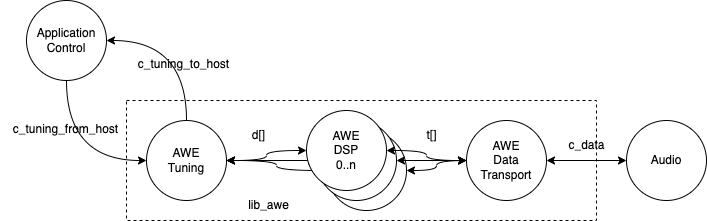

AWE Library User Guide
======================

Introduction
------------

AudioWeaver is a tool and libraries for implementing Digitial Signal Processing algorithms. It comprises a GUI and a set of libraries. Standard building blocks such as filters, equalisers, echo cancellers, can be assembled in the GUI and then executed on a device. A control library is available that enables on-line control of the blocks.

XCORE is a programmable multi-core device with flexible DSP and IO interfaces. The IO interfaces can be programmed to, for example, I2S, TDM, USB, ADAT or S/PDIF interfaces (or indeed any other interface), and the DSP capability can be used to operate on data that is received from or sent to these interfaces. In addition to interfaces and DSP, XCORE devices can also execute control code or even ML inference engines.

Lib_awe is a port of AudioWeaver for XMOS's powerful xcore.ai device. It contains code for software threads which wrap the core library and provide easy interfacing to both audio streaming components such as I2S and USB Audio as well as control interfacing to allow control and loading of pre-built designs from a host or internally from the device.

It utilises xcore.ai's multi-threaded architecture and vector processing unit to provide very high performance and predictable timing required by embedded systems.

.. note::
    This document refers to the XMOS specific implementation details. DSP Concepts provide several documents on the usage and integration of Audio Weaver into user system. Please refer to https://documentation.dspconcepts.com for documentation specific to Audio Weaver.

For reference, we refer to the following repositories that you may want to
use:

* <https://github.com/xmos/lib_awe.git> for the library that integrates
  AudioWeaver and XCORE.

* <https://github.com/xmos/lib_xua.git> for the USB Audio library
  design

Architecture
------------

Lib_awe provides an interface to the audio streaming and control functions using XCORE channels which allow placement of the application blocks on different tiles from lib_awe.

   lib_awe thread diagram

Lib_Awe consists of a group of threads. There are a statically define number (maximum 5) of DSP worker threads which perform the AWE core functionality within the AudioWeaver runtime core.

To support audio streaming an audio transport thread provides a channel interface to the Audio Weaver awe_audioImportSamples() and awe_audioExportSamples() functions. The purpose of this thread is to simplify connection to XMOS audio streaming components and user application logic and allows placement of the user selected application logic on different tiles.

Finally, a tuning thread is provided which abstracts away the awe_packetProcess() function calls and provides a channel API and again provides a channel based interface allowing placement of control to be on a different tile. In AWE language, this provides a ``tuning interface`` which is different from a ``control interface`` in that the control interface uses function calls. The same functionality is available for both AWE approaches however for the XCORE port the ``tuning interface`` method is default since it allows logic to be placed on a remote tile which does not share the memory space with the AWE tile.

All of the above threads for the core lib_awe need to be placed on the same tile. Since the majority of one tile's RAM and threads are used by lib_awe it is typical to dedicate one tile to lib_awe and use the other tile for application logic. However, low-memory usage tasks such as I2S may also be placed on the lib_awe tile (when required by hardware IO constraints) and this is demonstrated in the USB Audio Example.

Lib_awe API
-----------

In order to use the functions, one needs to configure the library to use the correct number of audio channels, threads, and heaps. To this effect, create a file ``awe_conf.h`` in your project that defines the following values:

  =============================== ===========
  Define                          Values
  =============================== ===========
  AWE_DSP_THREAD_NUM              1..5
  AWE_INPUT_CHANNELS              0 or more
  AWE_OUTPUT_CHANNELS             0 or more
  AUDIO_INPUT_CHANNELS            0 or more
  AUDIO_OUTPUT_CHANNELS           0 or more
  AWE_BLOCK_SIZE                  32
  AWE_HEAP_SIZE                   4096
  =============================== ===========

Some values are, at present, pre-set:

  =============================== ===========
  Define                          Values
  =============================== ===========
  Sample rate                     48,000 Hz
  =============================== ===========

A single function is provided to wrap the entire lib_awe implementation and automatically spawns all of the worker and helper threads. In addition, where USB/HID is used as the control interface, an API is provided which takes care of translating messages to and from the HID endpoint and to and from the lib_awe tuning thread. Other interfaces may be used such as UART or I2C.

.. doxygengroup:: lib_awe
    :content-only:

Application Examples
--------------------

A number of sample applications are provided to help you get up and running quickly. The sample application provided is called ``app_usb_audio_awe``. It is based on the XMOS USB Audio reference design and associated XK-AUDIO-316-MC hardware. It is very closely related to the standard USB Audio reference design provided by XMOS. Documentation for this can be found here `sw_usb_audio design guide <https://www.xmos.com/download/sw_usb_audio:-sw_usb_audio-(user-guide)(v8_1_0).pdf>`_ 

DSP Concepts provide a helpful setup guide which can be found in the file ``User_Guide_for_XMOS_EVK_with_AWE.pdf`` provided in this repo which is designed to help you get up and running as quickly as possible using this example.

There are three build profiles provided each one providing a different audio source/sink or tuning data path:

.. list-table:: Example Application Builds
   :widths: 25 25 50
   :header-rows: 1

   * - Build
     - Data path
     - Tuning path
   * - UA
     - USB Audio to target, Line out from target
     - USB / HID
   * - I2S
     - Line in to target, Line out from target
     - USB / HID
   * - UA_STANDALONE
     - USB Audio to target, Line out from target
     - Internal to firmware 

UA Build
........

The feature set of this build is as follows:

    - USB Audio Class 2.0 (High Speed)
    - Stereo input from the host
    - Stereo output on the OUT 1/2 3.5 mm analog jack
    - Audio from the host is pumped through the AWE framework before being played on the output jack
    - Asynchronous clocking (local audio clock to hardware)
    - 24 bit Sample resolution
    - 48 kHz sample rate
    - Tuning to AWE provided over USB HID with VID 0x20b1 and PID 0x0018 supporting live tuning from the Audioweaver application

.. note::
    When the firmware boots, there is no design loaded so you will not hear any sound played from the host. Please load an AWB from the host using the Audioweaver application.

I2S Build
.........

The feature set of this build is as follows:

    - Stereo input from the IN 1/2 3.5 mm analog jack
    - Stereo output on the OUT 1/2 3.5 mm analog jack
    - Audio from the host is pumped through the AWE framework before being played on the output jack
    - USB Audio Class 1.0 (Full Speed)
    - Tuning to AWE provided over USB HID with VID 0x20b1 and PID 0x0018 supporting live tuning from the Audioweaver application

    .. note::
        When the firmware boots, there is no design loaded so you will not hear any sound played from the host. Please load an AWB from the host using the Audioweaver application.

UA_STANDALONE Build
...................

The feature set of this build is as follows:

    - USB Audio Class 2.0 (High Speed)
    - Stereo input from the host
    - Stereo output on the OUT 1/2 3.5 mm analog jack
    - Audio from the host is pumped through the AWE framework before being played on the output jack
    - Asynchronous clocking (local audio clock to hardware)
    - 24 bit Sample resolution
    - 48 kHz sample rate
    - Tuning to AWE provided by a control thread in the firmware on Tile[0]

The control works as follows:

.. list-table:: UA_STANDALONE control
   :widths: 25 50
   :header-rows: 1

   * - Button
     - Function
   * - 2
     - Load the ``PlayBasic_3thread`` AWB file which contains the multi-band compressor example
   * - 1
     - Load the ``simple_volume`` AWB file which contains a passthrough with volume control
   * - 0
     - When the ``simple_volume`` AWB is selected, it controls the volume in -10 dB incremenets. No function otherwise.

Building the Examples
.....................

The following section assumes you have downloaded and installed the XMOS `tools <https://www.xmos.com/software-tools/>`_ minimum version 15.2.1. Now open a tools command prompt.

You will first need to download both ``lib_awe`` and ``xcommon_cmake`` to your chose sandbox directory::

    cd my_sandbox
    git clone git@github.com:xmos/xcommon_cmake.git
    git clone git@github.com:xmos/lib_awe.git

Your sandbox root directory listing will look something like this::

    lib_awe     xcommon_cmake

Next you need to set the environment for xcommon-cmake:

.. tab:: MacOS and Linux

    .. code-block:: console

       # MacOS and Linux
       export XMOS_CMAKE_PATH=/home/user/xcommon_cmake

.. tab:: Windows

    .. code-block:: console

       # Windows
       set XMOS_CMAKE_PATH=C:\Users\user\xcommon_cmake

Finally, ensure you have the lib_awe.a file placed in the lib_awe/lib/xs3a directory. This is the core archive file containing the AWE library::

    cp lib_awe.a lib_awe/lib_awe/lib/xs3a

.. note::
    The ``lib_awe.a`` file is not provided as part of the lib_awe repository for security reasons. Please obtain this from your XMOS contact directly.

To build using xcommon-cmake:

.. tab:: MacOS and Linux

    .. code-block:: console

       # MacOS and Linux
       cd lib_awe
       cd examples
       cd app_usb_audio_awe
       cmake -G "Unix Makefiles" -B build
       xmake -j -C build

.. tab:: Windows

    .. code-block:: console

       # Windows
       cd lib_awe
       cd examples
       cd app_usb_audio_awe
       cmake -G "Unix Makefiles" -B build
       xmake -C build
    

This will build both the UA (USB Audio) and I2S (I2S only for data transport but with USB/HID enabled for control) binaries. All of the required dependencies will be downloaded at this step. This will only happen the first time you build.

The application uses approximately 49 kB on Tile[0] and 510 kB on Tile[1], of 512 kB on each tile. 

Running the Examples
....................

To run the application use the following command from the lib_awe/app_usb_audio_awe directory::

    xrun bin/<build>/app_usb_audio_awe_<build>.xe

Alternatively to make the design non-volatile by programming in to flash memory use the following command::

    xflash bin/<build>/app_usb_audio_awe_<build>.xe

The USB audio device should appear in your host OS's audio settings window.

.. note::
    No audio will be passed through from the host to the 3.5 mm jack until an AWE design is loaded.

