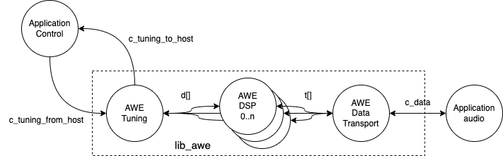

AWE Library User Guide
======================

Introduction
------------

AudioWeaver is a tool and libraries for implementing Digital Signal Processing algorithms. It comprises a GUI and a set of libraries. Standard building blocks such as filters, equalisers, echo cancellers, can be assembled in the GUI and then executed on a device. A control library is available that enables on-line tuning of the processing blocks.

XCORE is a programmable multi-core device with flexible DSP and IO interfaces. The IO interfaces can be programmed to, for example, I2S, TDM, USB, ADAT or S/PDIF interfaces (or indeed any other interface), and the DSP capability can be used to operate on data that is received from or sent to these interfaces. In addition to interfaces and DSP, XCORE devices can also execute control code or even ML inference engines.

Lib_awe is a port of AudioWeaver for XMOS's powerful xcore.ai device. It contains code for software threads which wrap the core library and provide easy interfacing to both audio streaming components such as I2S and USB Audio as well as tuning interfacing to allow control and loading of pre-built designs from a host or internally from the device.

It utilises xcore.ai's multi-threaded architecture and vector processing unit to provide very high performance and predictable timing required by embedded systems.

.. note::
    This document refers to the XMOS specific implementation details. DSP Concepts provide several documents on the usage and integration of Audio Weaver into user system. Please refer to https://documentation.dspconcepts.com for documentation specific to Audio Weaver.

For reference, we refer to the following repositories that you may want to
use:

* <https://github.com/xmos/lib_awe.git> for the library that integrates
  AudioWeaver and XCORE.

* <https://github.com/xmos/lib_xua.git> for the USB Audio library
  design

Architecture
------------

Lib_awe provides an interface to the audio streaming and control functions using XCORE channels which allow placement of the application blocks on different tiles from lib_awe.

   lib_awe thread diagram

Lib_awe consists of a group of threads. There are a statically defined number (maximum 5) of DSP worker threads which perform the AWE core functionality within the Audioweaver runtime core.

To support audio streaming an audio transport thread provides a channel interface to the Audioweaver ``awe_audioImportSamples()`` and ``awe_audioExportSamples()`` functions. The purpose of this thread is to simplify connection to XMOS audio streaming components and user application logic and allows placement of the user application logic on a different tile.

Finally, a tuning thread is provided which abstracts away the awe_packetProcess() function calls and provides a channel API and again provides a channel based interface allowing placement of control to be on a different tile. In AWE language, this provides a ``tuning interface`` which is different from a ``control interface`` in that the control interface uses function calls and tuning is a remote operation. The same functionality is available for both AWE approaches however, for the XCORE port, the ``tuning interface`` method is default since it allows control logic to be placed on a remote tile that does not share the memory space with the AWE tile.

The channel-based tuning interface supports multiple clients. The USB/HID and internal ``xawe_*****`` commands (see API) implement a mutex which allows multiple instances of tuning to be used at the same time so long as they are all on the same tile. The majority of the tuning commands consist of a command and a response however it should be noted that, when loading an AWB file (which is essentially a block of commands) from AWE Designer, interrupting the load with other commands may result in undefined behavior. The internal ``awe_loadAWB***`` commands that can be used from the firmware do implement locking around the whole image load operation and so cannot be interrupted by an external tuning command.

All of the above threads for the core lib_awe need to be placed on the same tile. Since the majority of one tile's RAM and many of the threads are used by lib_awe it is typical to dedicate one tile to lib_awe and use the other tile for application logic. However, low-memory usage tasks such as I2S may also be placed on the lib_awe tile (when required by hardware IO constraints) and this is demonstrated in the USB Audio Example.

An additional thread may be used in the case where the AWE Flash File System (FFS) is enabled. The FFS can be used to store compiled AWE design files. It provides a remote flash memory access server meaning that the AWE Core and the flash memory IO may exist on different tiles. Use of the FFS is optional and can be enabled or disabled using defines (see API). The flash server makes use of the API provided in the XMOS tools ``quadflashlib.h``. Documentation regarding this can be found in the `XTC tools manual <https://www.xmos.com/documentation/XM-014363-PC-9/html/tools-guide/tools-ref/libraries/libflash-api/libflash-api.html>`_.

Lib_awe API
-----------

In order to use the functions, one needs to configure the library to use the correct number of audio channels, threads, and heaps. To this effect, create a file ``awe_conf.h`` in your project that defines the following values:

  =============================== ============
  Define                          Values
  =============================== ============
  AWE_DSP_THREAD_NUM              1..5
  AWE_INPUT_CHANNELS              0 or more
  AWE_OUTPUT_CHANNELS             0 or more
  AWE_BLOCK_SIZE                  32 nominal
  AWE_HEAP_SIZE_LONG_WORDS        1024 or more
  =============================== ============

The ``AWE_BLOCK_SIZE`` value may be adjusted and designs can be made according to this setting however 32 is recommended as a good trade-off between system latency, memory usage and CPU efficiency which is higher for larger block sizes.

``AWE_HEAP_SIZE_LONG_WORDS`` is dependent on your particular design requirements. Even in maximal configurations, AWE on XCORE allows for at least 40 k long words of heap size.

Some values are, at present, pre-set:

  =============================== ===========
  Define                          Values
  =============================== ===========
  Sample rate                     48,000 Hz
  =============================== ===========

A single function is provided to wrap the entire lib_awe implementation and automatically spawns all of the worker and helper threads. If the FFS is used then this thread must be started by the user. In addition, where USB/HID is used as the control interface, an API is provided which takes care of translating messages to and from the HID endpoint and to and from the lib_awe tuning thread. Lib_awe also provides a number of remote tuning function APIs which allow loading of AWB designs, profiling and the setting and getting and getting of tuning parameters from firmware. The external USB/HID interface may co-exist with internal tuning functions. Other interfaces may be used such as UART or I2C although these are not currently implemented.

.. doxygengroup:: lib_awe
    :content-only:

Application Examples
--------------------

A number of sample applications are provided to help you get up and running quickly based on the XK-AUDIO-316-MC hardware and standard USB Audio reference design provided by XMOS in ``sw_usb_audio``. 

The application example source code and documentation may be found at `an02016 <https://github.com/xmosnotes/an02016>`_.
